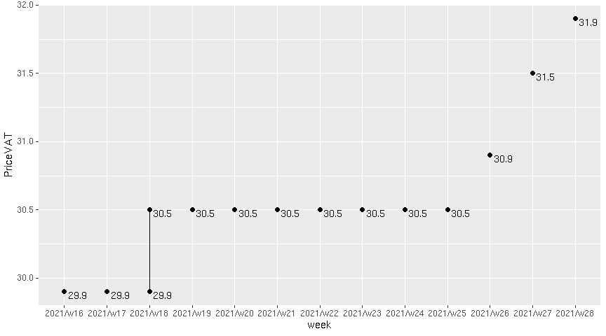
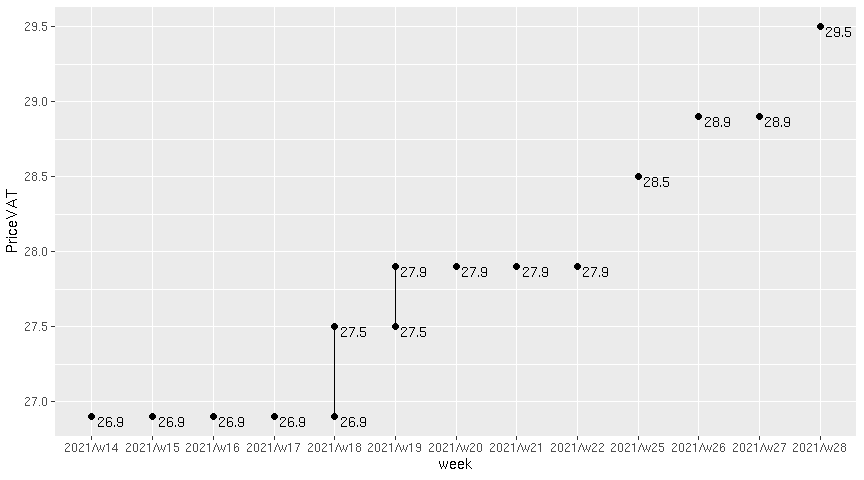
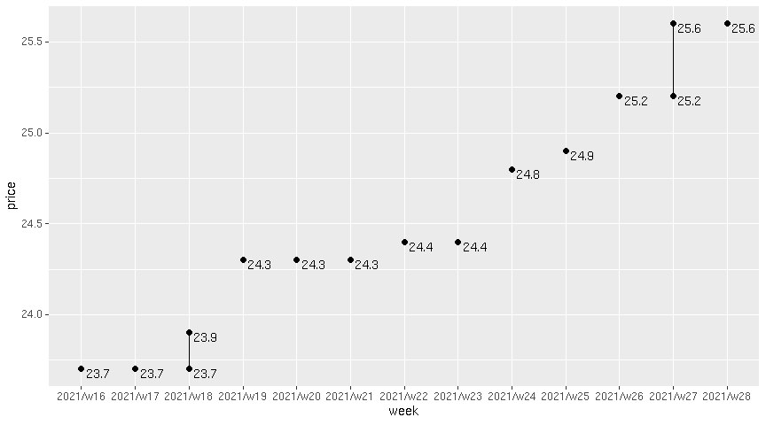
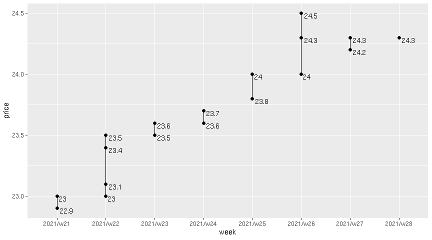
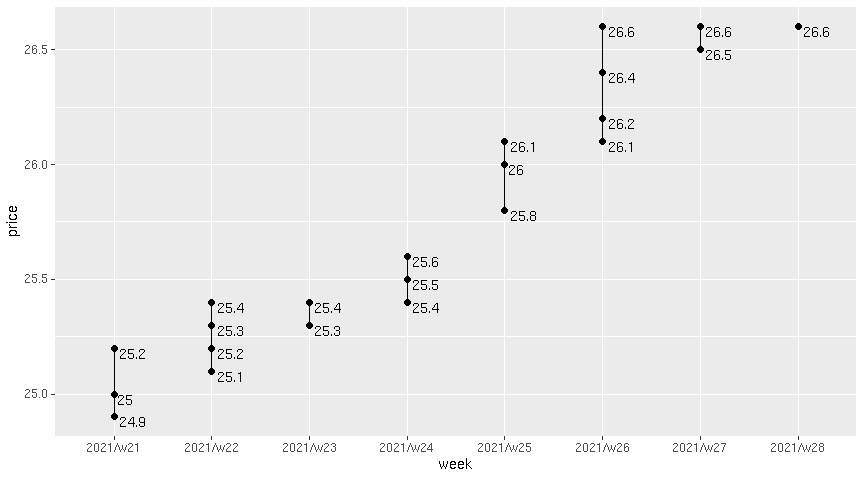

Spot On
================

|       Date |     Week |
|-----------:|---------:|
| 2023-10-02 | 2023/w40 |

### Tank Ono

> Gasoline BA95

| vendor  | origin   | week     | date       | day       | fuel      | price | PriceVAT |
|:--------|:---------|:---------|:-----------|:----------|:----------|------:|---------:|
| TankOno | webslurp | 2023/w40 | 2023-10-02 | Monday    | NATURAL95 | 32.15 |     38.9 |
| TankOno | webslurp | 2023/w39 | 2023-09-25 | Monday    | NATURAL95 | 32.15 |     38.9 |
| TankOno | webslurp | 2023/w38 | 2023-09-22 | Friday    | NATURAL95 | 32.15 |     38.9 |
| TankOno | webslurp | 2023/w38 | 2023-09-21 | Thursday  | NATURAL95 | 32.15 |     38.9 |
| TankOno | webslurp | 2023/w38 | 2023-09-20 | Wednesday | NATURAL95 | 32.15 |     38.9 |
| TankOno | webslurp | 2023/w38 | 2023-09-19 | Tuesday   | NATURAL95 | 32.15 |     38.9 |
| TankOno | webslurp | 2023/w38 | 2023-09-18 | Monday    | NATURAL95 | 32.15 |     38.9 |

> Diesel

| vendor  | origin   | week     | date       | day       | fuel   | price | PriceVAT |
|:--------|:---------|:---------|:-----------|:----------|:-------|------:|---------:|
| TankOno | webslurp | 2023/w40 | 2023-10-02 | Monday    | DIESEL | 32.15 |     38.9 |
| TankOno | webslurp | 2023/w39 | 2023-09-25 | Monday    | DIESEL | 32.15 |     38.9 |
| TankOno | webslurp | 2023/w38 | 2023-09-22 | Friday    | DIESEL | 32.15 |     38.9 |
| TankOno | webslurp | 2023/w38 | 2023-09-21 | Thursday  | DIESEL | 32.15 |     38.9 |
| TankOno | webslurp | 2023/w38 | 2023-09-20 | Wednesday | DIESEL | 32.15 |     38.9 |
| TankOno | webslurp | 2023/w38 | 2023-09-19 | Tuesday   | DIESEL | 31.82 |     38.5 |
| TankOno | webslurp | 2023/w38 | 2023-09-18 | Monday    | DIESEL | 31.82 |     38.5 |

### Axigon

> Diesel

| vendor | origin   | week     | date       | day       | fuel   | price | PriceVAT |
|:-------|:---------|:---------|:-----------|:----------|:-------|------:|---------:|
| AXIGON | webslurp | 2023/w40 | 2023-10-02 | Monday    | Diesel |  33.6 |     40.7 |
| AXIGON | webslurp | 2023/w39 | 2023-09-25 | Monday    | Diesel |  33.9 |     41.0 |
| AXIGON | webslurp | 2023/w38 | 2023-09-22 | Friday    | Diesel |  33.9 |     41.0 |
| AXIGON | webslurp | 2023/w38 | 2023-09-21 | Thursday  | Diesel |  33.9 |     41.0 |
| AXIGON | webslurp | 2023/w38 | 2023-09-20 | Wednesday | Diesel |  33.9 |     41.0 |
| AXIGON | webslurp | 2023/w38 | 2023-09-19 | Tuesday   | Diesel |  33.9 |     41.0 |
| AXIGON | webslurp | 2023/w38 | 2023-09-18 | Monday    | Diesel |  33.0 |     40.0 |

### UIC

> Diesel

| vendor | origin  | week     | date       | day       | fuel           | price | priceVAT |
|:-------|:--------|:---------|:-----------|:----------|:---------------|------:|---------:|
| UIC    | web/csv | 2023/w39 | 2023-09-30 | Saturday  | Motorová nafta |  32.3 |     39.1 |
| UIC    | web/csv | 2023/w39 | 2023-09-28 | Thursday  | Motorová nafta |  32.0 |     38.7 |
| UIC    | web/csv | 2023/w39 | 2023-09-27 | Wednesday | Motorová nafta |  31.8 |     38.5 |
| UIC    | web/csv | 2023/w39 | 2023-09-26 | Tuesday   | Motorová nafta |  31.9 |     38.6 |
| UIC    | web/csv | 2023/w38 | 2023-09-23 | Saturday  | Motorová nafta |  32.2 |     39.0 |
| UIC    | web/csv | 2023/w38 | 2023-09-22 | Friday    | Motorová nafta |  32.2 |     39.0 |
| UIC    | web/csv | 2023/w38 | 2023-09-21 | Thursday  | Motorová nafta |  31.9 |     38.6 |
| UIC    | web/csv | 2023/w38 | 2023-09-20 | Wednesday | Motorová nafta |  32.1 |     38.8 |
| UIC    | web/csv | 2023/w38 | 2023-09-19 | Tuesday   | Motorová nafta |  32.4 |     39.2 |
| UIC    | web/csv | 2023/w37 | 2023-09-16 | Saturday  | Motorová nafta |  32.7 |     39.6 |
| UIC    | web/csv | 2023/w37 | 2023-09-15 | Friday    | Motorová nafta |  32.5 |     39.3 |
| UIC    | web/csv | 2023/w37 | 2023-09-14 | Thursday  | Motorová nafta |  32.1 |     38.8 |
| UIC    | web/csv | 2023/w37 | 2023-09-13 | Wednesday | Motorová nafta |  31.9 |     38.6 |
| UIC    | web/csv | 2023/w37 | 2023-09-12 | Tuesday   | Motorová nafta |  31.6 |     38.2 |

> Gasoline BA95

| vendor | origin  | week     | date       | day       | fuel        | price | priceVAT |
|:-------|:--------|:---------|:-----------|:----------|:------------|------:|---------:|
| UIC    | web/csv | 2023/w39 | 2023-09-30 | Saturday  | Benzin BA95 |  31.5 |     38.1 |
| UIC    | web/csv | 2023/w39 | 2023-09-28 | Thursday  | Benzin BA95 |  31.7 |     38.4 |
| UIC    | web/csv | 2023/w39 | 2023-09-27 | Wednesday | Benzin BA95 |  31.7 |     38.4 |
| UIC    | web/csv | 2023/w39 | 2023-09-26 | Tuesday   | Benzin BA95 |  32.0 |     38.7 |
| UIC    | web/csv | 2023/w38 | 2023-09-23 | Saturday  | Benzin BA95 |  32.1 |     38.8 |
| UIC    | web/csv | 2023/w38 | 2023-09-22 | Friday    | Benzin BA95 |  32.3 |     39.1 |
| UIC    | web/csv | 2023/w38 | 2023-09-21 | Thursday  | Benzin BA95 |  32.3 |     39.1 |
| UIC    | web/csv | 2023/w38 | 2023-09-20 | Wednesday | Benzin BA95 |  32.4 |     39.2 |
| UIC    | web/csv | 2023/w38 | 2023-09-19 | Tuesday   | Benzin BA95 |  32.7 |     39.6 |
| UIC    | web/csv | 2023/w37 | 2023-09-16 | Saturday  | Benzin BA95 |  32.6 |     39.4 |
| UIC    | web/csv | 2023/w37 | 2023-09-15 | Friday    | Benzin BA95 |  32.5 |     39.3 |
| UIC    | web/csv | 2023/w37 | 2023-09-14 | Thursday  | Benzin BA95 |  32.2 |     39.0 |
| UIC    | web/csv | 2023/w37 | 2023-09-13 | Wednesday | Benzin BA95 |  32.1 |     38.8 |
| UIC    | web/csv | 2023/w37 | 2023-09-12 | Tuesday   | Benzin BA95 |  32.1 |     38.8 |

