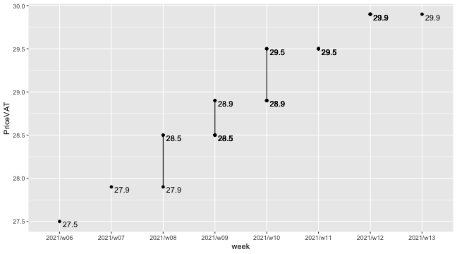
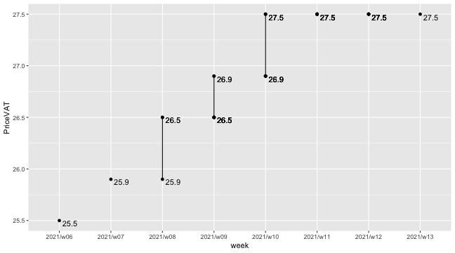
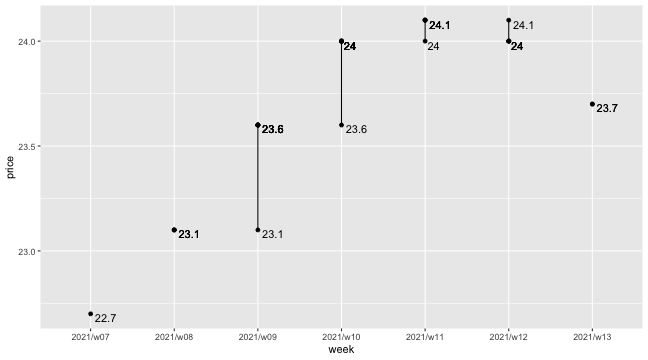
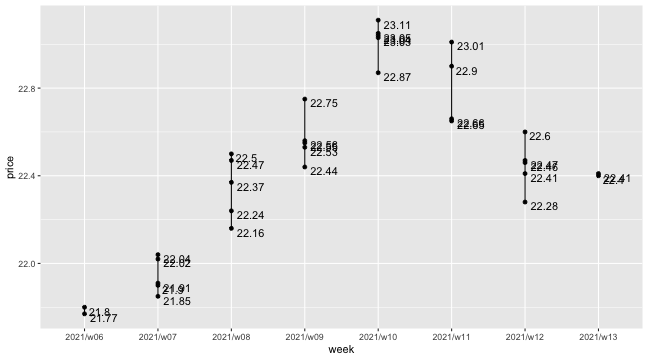
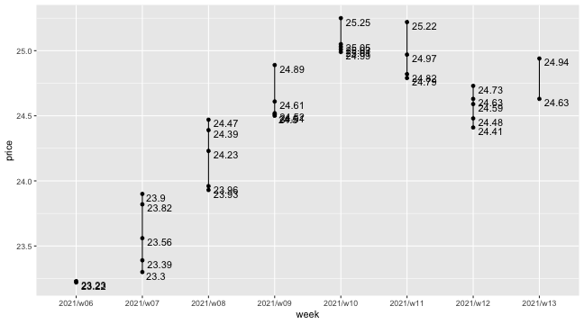

|    Today's| This Week|
|----------:|---------:|
| 2021-03-31|  2021/w13|

### Tank Ono

> Gasoline BA95

|vendor  |origin   |week     |date       |day       |fuel      | price| PriceVAT|
|:-------|:--------|:--------|:----------|:---------|:---------|-----:|--------:|
|TankOno |webslurp |2021/w13 |2021-03-31 |Wednesday |NATURAL95 | 24.71|     29.9|
|TankOno |webslurp |2021/w12 |2021-03-27 |Saturday  |NATURAL95 | 24.71|     29.9|
|TankOno |webslurp |2021/w12 |2021-03-25 |Thursday  |NATURAL95 | 24.71|     29.9|
|TankOno |webslurp |2021/w12 |2021-03-24 |Wednesday |NATURAL95 | 24.71|     29.9|
|TankOno |webslurp |2021/w12 |2021-03-23 |Tuesday   |NATURAL95 | 24.71|     29.9|
|TankOno |webslurp |2021/w12 |2021-03-22 |Monday    |NATURAL95 | 24.71|     29.9|
|TankOno |webslurp |2021/w11 |2021-03-19 |Friday    |NATURAL95 | 24.38|     29.5|

> Diesel

|vendor  |origin   |week     |date       |day       |fuel   | price| PriceVAT|
|:-------|:--------|:--------|:----------|:---------|:------|-----:|--------:|
|TankOno |webslurp |2021/w13 |2021-03-31 |Wednesday |DIESEL | 22.73|     27.5|
|TankOno |webslurp |2021/w12 |2021-03-27 |Saturday  |DIESEL | 22.73|     27.5|
|TankOno |webslurp |2021/w12 |2021-03-25 |Thursday  |DIESEL | 22.73|     27.5|
|TankOno |webslurp |2021/w12 |2021-03-24 |Wednesday |DIESEL | 22.73|     27.5|
|TankOno |webslurp |2021/w12 |2021-03-23 |Tuesday   |DIESEL | 22.73|     27.5|
|TankOno |webslurp |2021/w12 |2021-03-22 |Monday    |DIESEL | 22.73|     27.5|
|TankOno |webslurp |2021/w11 |2021-03-19 |Friday    |DIESEL | 22.73|     27.5|

### Axigon

> Diesel

|vendor |origin   |week     |date       |day       |fuel   | price| PriceVAT|
|:------|:--------|:--------|:----------|:---------|:------|-----:|--------:|
|AXIGON |webslurp |2021/w13 |2021-03-31 |Wednesday |Diesel | 23.71|     28.7|
|AXIGON |webslurp |2021/w12 |2021-03-27 |Saturday  |Diesel | 23.96|     29.0|
|AXIGON |webslurp |2021/w12 |2021-03-25 |Thursday  |Diesel | 23.96|     29.0|
|AXIGON |webslurp |2021/w12 |2021-03-24 |Wednesday |Diesel | 23.96|     29.0|
|AXIGON |webslurp |2021/w12 |2021-03-23 |Tuesday   |Diesel | 23.96|     29.0|
|AXIGON |webslurp |2021/w12 |2021-03-22 |Monday    |Diesel | 24.12|     29.2|
|AXIGON |webslurp |2021/w11 |2021-03-19 |Friday    |Diesel | 24.12|     29.2|

### UIC

> Diesel

|vendor |origin  |week     |date       |day       |fuel           | price| priceVAT|
|:------|:-------|:--------|:----------|:---------|:--------------|-----:|--------:|
|UIC    |web/csv |2021/w13 |2021-03-31 |Wednesday |Motorová nafta | 22.41|    27.12|
|UIC    |web/csv |2021/w13 |2021-03-30 |Tuesday   |Motorová nafta | 22.40|    27.10|
|UIC    |web/csv |2021/w12 |2021-03-27 |Saturday  |Motorová nafta | 22.46|    27.18|
|UIC    |web/csv |2021/w12 |2021-03-26 |Friday    |Motorová nafta | 22.28|    26.96|
|UIC    |web/csv |2021/w12 |2021-03-25 |Thursday  |Motorová nafta | 22.41|    27.12|
|UIC    |web/csv |2021/w12 |2021-03-24 |Wednesday |Motorová nafta | 22.47|    27.19|
|UIC    |web/csv |2021/w12 |2021-03-23 |Tuesday   |Motorová nafta | 22.60|    27.35|

> Gasoline BA95

|vendor |origin  |week     |date       |day       |fuel        | price| priceVAT|
|:------|:-------|:--------|:----------|:---------|:-----------|-----:|--------:|
|UIC    |web/csv |2021/w13 |2021-03-31 |Wednesday |Benzin BA95 | 24.94|    30.18|
|UIC    |web/csv |2021/w13 |2021-03-30 |Tuesday   |Benzin BA95 | 24.63|    29.80|
|UIC    |web/csv |2021/w12 |2021-03-27 |Saturday  |Benzin BA95 | 24.73|    29.92|
|UIC    |web/csv |2021/w12 |2021-03-26 |Friday    |Benzin BA95 | 24.59|    29.75|
|UIC    |web/csv |2021/w12 |2021-03-25 |Thursday  |Benzin BA95 | 24.41|    29.54|
|UIC    |web/csv |2021/w12 |2021-03-24 |Wednesday |Benzin BA95 | 24.48|    29.62|
|UIC    |web/csv |2021/w12 |2021-03-23 |Tuesday   |Benzin BA95 | 24.63|    29.80|

