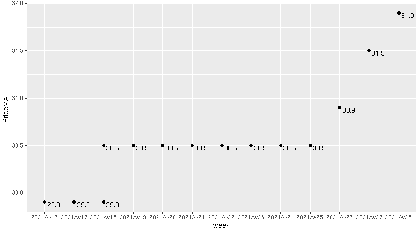
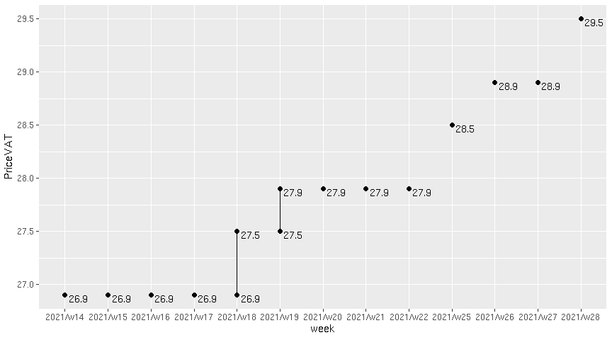
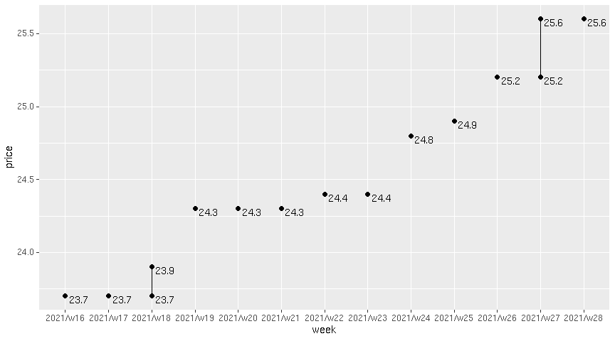
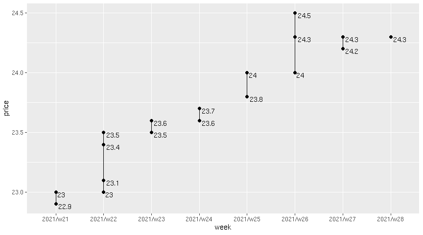
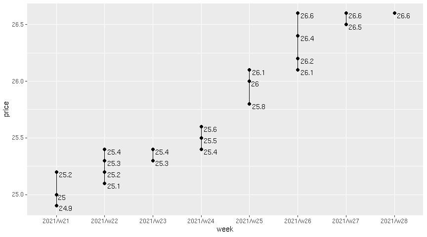

Spot On
================

|    Today’s | This Week |
|-----------:|----------:|
| 2021-07-13 |  2021/w28 |

### Tank Ono

> Gasoline BA95

| vendor  | origin   | week     | date       | day       | fuel      | price | PriceVAT |
|:--------|:---------|:---------|:-----------|:----------|:----------|------:|---------:|
| TankOno | webslurp | 2021/w28 | 2021-07-13 | Tuesday   | NATURAL95 | 26.36 |     31.9 |
| TankOno | webslurp | 2021/w28 | 2021-07-12 | Monday    | NATURAL95 | 26.36 |     31.9 |
| TankOno | webslurp | 2021/w27 | 2021-07-08 | Thursday  | NATURAL95 | 26.03 |     31.5 |
| TankOno | webslurp | 2021/w27 | 2021-07-07 | Wednesday | NATURAL95 | 26.03 |     31.5 |
| TankOno | webslurp | 2021/w27 | 2021-07-06 | Tuesday   | NATURAL95 | 26.03 |     31.5 |
| TankOno | webslurp | 2021/w26 | 2021-06-29 | Tuesday   | NATURAL95 | 25.54 |     30.9 |
| TankOno | webslurp | 2021/w25 | 2021-06-25 | Friday    | NATURAL95 | 25.21 |     30.5 |

> Diesel

| vendor  | origin   | week     | date       | day       | fuel   | price | PriceVAT |
|:--------|:---------|:---------|:-----------|:----------|:-------|------:|---------:|
| TankOno | webslurp | 2021/w28 | 2021-07-13 | Tuesday   | DIESEL | 24.38 |     29.5 |
| TankOno | webslurp | 2021/w28 | 2021-07-12 | Monday    | DIESEL | 24.38 |     29.5 |
| TankOno | webslurp | 2021/w27 | 2021-07-08 | Thursday  | DIESEL | 23.88 |     28.9 |
| TankOno | webslurp | 2021/w27 | 2021-07-07 | Wednesday | DIESEL | 23.88 |     28.9 |
| TankOno | webslurp | 2021/w27 | 2021-07-06 | Tuesday   | DIESEL | 23.88 |     28.9 |
| TankOno | webslurp | 2021/w26 | 2021-06-29 | Tuesday   | DIESEL | 23.88 |     28.9 |
| TankOno | webslurp | 2021/w25 | 2021-06-25 | Friday    | DIESEL | 23.55 |     28.5 |

### Axigon

> Diesel

| vendor | origin   | week     | date       | day       | fuel   | price | PriceVAT |
|:-------|:---------|:---------|:-----------|:----------|:-------|------:|---------:|
| AXIGON | webslurp | 2021/w28 | 2021-07-13 | Tuesday   | Diesel |  25.6 |     31.0 |
| AXIGON | webslurp | 2021/w28 | 2021-07-12 | Monday    | Diesel |  25.6 |     31.0 |
| AXIGON | webslurp | 2021/w27 | 2021-07-08 | Thursday  | Diesel |  25.6 |     31.0 |
| AXIGON | webslurp | 2021/w27 | 2021-07-07 | Wednesday | Diesel |  25.2 |     30.5 |
| AXIGON | webslurp | 2021/w27 | 2021-07-06 | Tuesday   | Diesel |  25.2 |     30.5 |
| AXIGON | webslurp | 2021/w26 | 2021-06-29 | Tuesday   | Diesel |  25.2 |     30.5 |
| AXIGON | webslurp | 2021/w25 | 2021-06-25 | Friday    | Diesel |  24.9 |     30.2 |

### UIC

> Diesel

| vendor | origin  | week     | date       | day      | fuel           | price | priceVAT |
|:-------|:--------|:---------|:-----------|:---------|:---------------|------:|---------:|
| UIC    | web/csv | 2021/w28 | 2021-07-13 | Tuesday  | Motorová nafta |  24.3 |     29.4 |
| UIC    | web/csv | 2021/w27 | 2021-07-10 | Saturday | Motorová nafta |  24.2 |     29.3 |
| UIC    | web/csv | 2021/w27 | 2021-07-09 | Friday   | Motorová nafta |  24.3 |     29.4 |
| UIC    | web/csv | 2021/w27 | 2021-07-08 | Thursday | Motorová nafta |  24.3 |     29.4 |
| UIC    | web/csv | 2021/w26 | 2021-07-03 | Saturday | Motorová nafta |  24.5 |     29.6 |
| UIC    | web/csv | 2021/w26 | 2021-07-02 | Friday   | Motorová nafta |  24.3 |     29.4 |
| UIC    | web/csv | 2021/w26 | 2021-07-01 | Thursday | Motorová nafta |  24.0 |     29.0 |

> Gasoline BA95

| vendor | origin  | week     | date       | day      | fuel        | price | priceVAT |
|:-------|:--------|:---------|:-----------|:---------|:------------|------:|---------:|
| UIC    | web/csv | 2021/w28 | 2021-07-13 | Tuesday  | Benzin BA95 |  26.6 |     32.2 |
| UIC    | web/csv | 2021/w27 | 2021-07-10 | Saturday | Benzin BA95 |  26.6 |     32.2 |
| UIC    | web/csv | 2021/w27 | 2021-07-09 | Friday   | Benzin BA95 |  26.5 |     32.1 |
| UIC    | web/csv | 2021/w27 | 2021-07-08 | Thursday | Benzin BA95 |  26.5 |     32.1 |
| UIC    | web/csv | 2021/w26 | 2021-07-03 | Saturday | Benzin BA95 |  26.6 |     32.2 |
| UIC    | web/csv | 2021/w26 | 2021-07-02 | Friday   | Benzin BA95 |  26.4 |     31.9 |
| UIC    | web/csv | 2021/w26 | 2021-07-01 | Thursday | Benzin BA95 |  26.2 |     31.7 |

