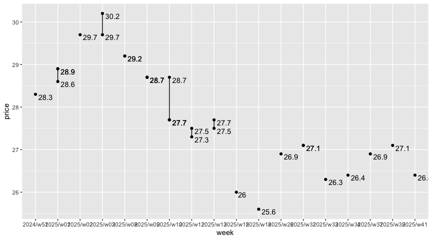

Spot On
================

|       Date |     Week |
|-----------:|---------:|
| 2024-06-11 | 2024/w24 |

### Tank Ono

> Gasoline BA95

| vendor  | origin   | week     | date       | day       | fuel      | price | PriceVAT |
|:--------|:---------|:---------|:-----------|:----------|:----------|------:|---------:|
| TankOno | webslurp | 2024/w24 | 2024-06-11 | úterý     | NATURAL95 | 29.34 |     35.5 |
| TankOno | webslurp | 2024/w20 | 2024-05-17 | Friday    | NATURAL95 | 30.50 |     36.9 |
| TankOno | webslurp | 2024/w20 | 2024-05-14 | Tuesday   | NATURAL95 | 30.99 |     37.5 |
| TankOno | webslurp | 2024/w19 | 2024-05-10 | Friday    | NATURAL95 | 30.99 |     37.5 |
| TankOno | webslurp | 2024/w18 | 2024-05-04 | Saturday  | NATURAL95 | 31.82 |     38.5 |
| TankOno | webslurp | 2024/w18 | 2024-04-30 | Tuesday   | NATURAL95 | 32.15 |     38.9 |
| TankOno | webslurp | 2024/w16 | 2024-04-17 | Wednesday | NATURAL95 | 31.82 |     38.5 |

> Diesel

| vendor  | origin   | week     | date       | day       | fuel   | price | PriceVAT |
|:--------|:---------|:---------|:-----------|:----------|:-------|------:|---------:|
| TankOno | webslurp | 2024/w24 | 2024-06-11 | úterý     | DIESEL | 27.19 |     32.9 |
| TankOno | webslurp | 2024/w20 | 2024-05-17 | Friday    | DIESEL | 28.02 |     33.9 |
| TankOno | webslurp | 2024/w20 | 2024-05-14 | Tuesday   | DIESEL | 28.51 |     34.5 |
| TankOno | webslurp | 2024/w19 | 2024-05-10 | Friday    | DIESEL | 28.51 |     34.5 |
| TankOno | webslurp | 2024/w18 | 2024-05-04 | Saturday  | DIESEL | 28.84 |     34.9 |
| TankOno | webslurp | 2024/w18 | 2024-04-30 | Tuesday   | DIESEL | 29.67 |     35.9 |
| TankOno | webslurp | 2024/w16 | 2024-04-17 | Wednesday | DIESEL | 30.17 |     36.5 |

### Axigon

> Diesel

| vendor | origin   | week     | date       | day       | fuel   | price | PriceVAT |
|:-------|:---------|:---------|:-----------|:----------|:-------|------:|---------:|
| AXIGON | webslurp | 2024/w24 | 2024-06-11 | úterý     | Diesel |  28.7 |     34.7 |
| AXIGON | webslurp | 2024/w20 | 2024-05-17 | Friday    | Diesel |  29.7 |     36.0 |
| AXIGON | webslurp | 2024/w20 | 2024-05-14 | Tuesday   | Diesel |  29.7 |     36.0 |
| AXIGON | webslurp | 2024/w19 | 2024-05-10 | Friday    | Diesel |  29.7 |     36.0 |
| AXIGON | webslurp | 2024/w18 | 2024-05-04 | Saturday  | Diesel |  30.6 |     37.0 |
| AXIGON | webslurp | 2024/w18 | 2024-04-30 | Tuesday   | Diesel |  30.6 |     37.0 |
| AXIGON | webslurp | 2024/w16 | 2024-04-17 | Wednesday | Diesel |  31.4 |     38.0 |

### UIC

> Diesel

| vendor | origin  | week     | date       | day       | fuel           | price | priceVAT |
|:-------|:--------|:---------|:-----------|:----------|:---------------|------:|---------:|
| UIC    | web/csv | 2024/w24 | 2024-06-11 | Tuesday   | Motorová nafta |  27.2 |     32.9 |
| UIC    | web/csv | 2024/w23 | 2024-06-08 | Saturday  | Motorová nafta |  27.2 |     32.9 |
| UIC    | web/csv | 2024/w23 | 2024-06-07 | Friday    | Motorová nafta |  27.3 |     33.0 |
| UIC    | web/csv | 2024/w23 | 2024-06-06 | Thursday  | Motorová nafta |  27.2 |     32.9 |
| UIC    | web/csv | 2024/w23 | 2024-06-05 | Wednesday | Motorová nafta |  27.4 |     33.2 |
| UIC    | web/csv | 2024/w23 | 2024-06-04 | Tuesday   | Motorová nafta |  27.4 |     33.2 |
| UIC    | web/csv | 2024/w22 | 2024-06-01 | Saturday  | Motorová nafta |  27.8 |     33.6 |
| UIC    | web/csv | 2024/w22 | 2024-05-31 | Friday    | Motorová nafta |  28.1 |     34.0 |
| UIC    | web/csv | 2024/w22 | 2024-05-30 | Thursday  | Motorová nafta |  28.1 |     34.0 |
| UIC    | web/csv | 2024/w22 | 2024-05-29 | Wednesday | Motorová nafta |  28.1 |     34.0 |
| UIC    | web/csv | 2024/w22 | 2024-05-28 | Tuesday   | Motorová nafta |  28.0 |     33.9 |
| UIC    | web/csv | 2024/w21 | 2024-05-25 | Saturday  | Motorová nafta |  28.0 |     33.9 |
| UIC    | web/csv | 2024/w21 | 2024-05-24 | Friday    | Motorová nafta |  28.1 |     34.0 |
| UIC    | web/csv | 2024/w21 | 2024-05-23 | Thursday  | Motorová nafta |  28.1 |     34.0 |

> Gasoline BA95

| vendor | origin  | week     | date       | day       | fuel        | price | priceVAT |
|:-------|:--------|:---------|:-----------|:----------|:------------|------:|---------:|
| UIC    | web/csv | 2024/w24 | 2024-06-11 | Tuesday   | Benzin BA95 |  29.3 |     35.5 |
| UIC    | web/csv | 2024/w23 | 2024-06-08 | Saturday  | Benzin BA95 |  29.3 |     35.5 |
| UIC    | web/csv | 2024/w23 | 2024-06-07 | Friday    | Benzin BA95 |  29.4 |     35.6 |
| UIC    | web/csv | 2024/w23 | 2024-06-06 | Thursday  | Benzin BA95 |  29.2 |     35.3 |
| UIC    | web/csv | 2024/w23 | 2024-06-05 | Wednesday | Benzin BA95 |  29.3 |     35.5 |
| UIC    | web/csv | 2024/w23 | 2024-06-04 | Tuesday   | Benzin BA95 |  29.3 |     35.5 |
| UIC    | web/csv | 2024/w22 | 2024-06-01 | Saturday  | Benzin BA95 |  29.7 |     35.9 |
| UIC    | web/csv | 2024/w22 | 2024-05-31 | Friday    | Benzin BA95 |  29.8 |     36.1 |
| UIC    | web/csv | 2024/w22 | 2024-05-30 | Thursday  | Benzin BA95 |  30.0 |     36.3 |
| UIC    | web/csv | 2024/w22 | 2024-05-29 | Wednesday | Benzin BA95 |  30.1 |     36.4 |
| UIC    | web/csv | 2024/w22 | 2024-05-28 | Tuesday   | Benzin BA95 |  29.9 |     36.2 |
| UIC    | web/csv | 2024/w21 | 2024-05-25 | Saturday  | Benzin BA95 |  29.9 |     36.2 |
| UIC    | web/csv | 2024/w21 | 2024-05-24 | Friday    | Benzin BA95 |  29.9 |     36.2 |
| UIC    | web/csv | 2024/w21 | 2024-05-23 | Thursday  | Benzin BA95 |  30.1 |     36.4 |

