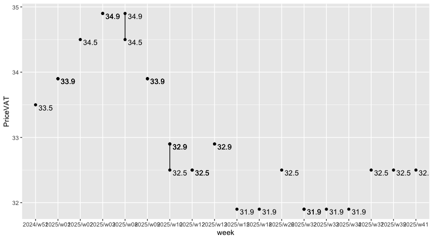

Spot On
================

|       Date |     Week |
|-----------:|---------:|
| 2024-03-28 | 2024/w13 |

### Tank Ono

> Gasoline BA95

| vendor  | origin   | week     | date       | day      | fuel      | price | PriceVAT |
|:--------|:---------|:---------|:-----------|:---------|:----------|------:|---------:|
| TankOno | webslurp | 2024/w13 | 2024-03-28 | Thursday | NATURAL95 | 30.99 |     37.5 |
| TankOno | webslurp | 2024/w13 | 2024-03-26 | Tuesday  | NATURAL95 | 30.17 |     36.5 |
| TankOno | webslurp | 2024/w12 | 2024-03-22 | Friday   | NATURAL95 | 30.17 |     36.5 |
| TankOno | webslurp | 2024/w12 | 2024-03-19 | Tuesday  | NATURAL95 | 30.17 |     36.5 |
| TankOno | webslurp | 2024/w09 | 2024-02-27 | Tuesday  | NATURAL95 | 30.17 |     36.5 |
| TankOno | webslurp | 2024/w06 | 2024-02-09 | Friday   | NATURAL95 | 29.34 |     35.5 |
| TankOno | webslurp | 2024/w06 | 2024-02-08 | Thursday | NATURAL95 | 29.34 |     35.5 |

> Diesel

| vendor  | origin   | week     | date       | day      | fuel   | price | PriceVAT |
|:--------|:---------|:---------|:-----------|:---------|:-------|------:|---------:|
| TankOno | webslurp | 2024/w13 | 2024-03-28 | Thursday | DIESEL | 29.67 |     35.9 |
| TankOno | webslurp | 2024/w13 | 2024-03-26 | Tuesday  | DIESEL | 29.67 |     35.9 |
| TankOno | webslurp | 2024/w12 | 2024-03-22 | Friday   | DIESEL | 29.67 |     35.9 |
| TankOno | webslurp | 2024/w12 | 2024-03-19 | Tuesday  | DIESEL | 29.67 |     35.9 |
| TankOno | webslurp | 2024/w09 | 2024-02-27 | Tuesday  | DIESEL | 30.50 |     36.9 |
| TankOno | webslurp | 2024/w06 | 2024-02-09 | Friday   | DIESEL | 29.34 |     35.5 |
| TankOno | webslurp | 2024/w06 | 2024-02-08 | Thursday | DIESEL | 29.34 |     35.5 |

### Axigon

> Diesel

| vendor | origin   | week     | date       | day      | fuel   | price | PriceVAT |
|:-------|:---------|:---------|:-----------|:---------|:-------|------:|---------:|
| AXIGON | webslurp | 2024/w13 | 2024-03-28 | Thursday | Diesel |  31.0 |     37.5 |
| AXIGON | webslurp | 2024/w13 | 2024-03-26 | Tuesday  | Diesel |  31.0 |     37.5 |
| AXIGON | webslurp | 2024/w12 | 2024-03-22 | Friday   | Diesel |  30.7 |     37.2 |
| AXIGON | webslurp | 2024/w12 | 2024-03-19 | Tuesday  | Diesel |  30.7 |     37.2 |
| AXIGON | webslurp | 2024/w09 | 2024-02-27 | Tuesday  | Diesel |  31.2 |     37.8 |
| AXIGON | webslurp | 2024/w06 | 2024-02-09 | Friday   | Diesel |  30.4 |     36.8 |
| AXIGON | webslurp | 2024/w06 | 2024-02-08 | Thursday | Diesel |  30.4 |     36.8 |

### UIC

> Diesel

| vendor | origin  | week     | date       | day       | fuel           | price | priceVAT |
|:-------|:--------|:---------|:-----------|:----------|:---------------|------:|---------:|
| UIC    | web/csv | 2024/w13 | 2024-03-28 | Thursday  | Motorová nafta |  29.6 |     35.8 |
| UIC    | web/csv | 2024/w13 | 2024-03-27 | Wednesday | Motorová nafta |  29.5 |     35.7 |
| UIC    | web/csv | 2024/w13 | 2024-03-26 | Tuesday   | Motorová nafta |  29.8 |     36.1 |
| UIC    | web/csv | 2024/w12 | 2024-03-23 | Saturday  | Motorová nafta |  29.6 |     35.8 |
| UIC    | web/csv | 2024/w12 | 2024-03-22 | Friday    | Motorová nafta |  29.5 |     35.7 |
| UIC    | web/csv | 2024/w12 | 2024-03-21 | Thursday  | Motorová nafta |  29.7 |     35.9 |
| UIC    | web/csv | 2024/w12 | 2024-03-20 | Wednesday | Motorová nafta |  29.7 |     35.9 |
| UIC    | web/csv | 2024/w12 | 2024-03-19 | Tuesday   | Motorová nafta |  29.6 |     35.8 |
| UIC    | web/csv | 2024/w11 | 2024-03-16 | Saturday  | Motorová nafta |  29.5 |     35.7 |
| UIC    | web/csv | 2024/w11 | 2024-03-15 | Friday    | Motorová nafta |  29.4 |     35.6 |
| UIC    | web/csv | 2024/w11 | 2024-03-14 | Thursday  | Motorová nafta |  29.4 |     35.6 |
| UIC    | web/csv | 2024/w11 | 2024-03-13 | Wednesday | Motorová nafta |  29.3 |     35.5 |
| UIC    | web/csv | 2024/w11 | 2024-03-12 | Tuesday   | Motorová nafta |  29.4 |     35.6 |
| UIC    | web/csv | 2024/w10 | 2024-03-09 | Saturday  | Motorová nafta |  29.4 |     35.6 |

> Gasoline BA95

| vendor | origin  | week     | date       | day       | fuel        | price | priceVAT |
|:-------|:--------|:---------|:-----------|:----------|:------------|------:|---------:|
| UIC    | web/csv | 2024/w13 | 2024-03-28 | Thursday  | Benzin BA95 |  31.2 |     37.8 |
| UIC    | web/csv | 2024/w13 | 2024-03-27 | Wednesday | Benzin BA95 |  31.0 |     37.5 |
| UIC    | web/csv | 2024/w13 | 2024-03-26 | Tuesday   | Benzin BA95 |  31.0 |     37.5 |
| UIC    | web/csv | 2024/w12 | 2024-03-23 | Saturday  | Benzin BA95 |  30.7 |     37.1 |
| UIC    | web/csv | 2024/w12 | 2024-03-22 | Friday    | Benzin BA95 |  30.6 |     37.0 |
| UIC    | web/csv | 2024/w12 | 2024-03-21 | Thursday  | Benzin BA95 |  30.5 |     36.9 |
| UIC    | web/csv | 2024/w12 | 2024-03-20 | Wednesday | Benzin BA95 |  30.4 |     36.8 |
| UIC    | web/csv | 2024/w12 | 2024-03-19 | Tuesday   | Benzin BA95 |  30.2 |     36.5 |
| UIC    | web/csv | 2024/w11 | 2024-03-16 | Saturday  | Benzin BA95 |  30.1 |     36.4 |
| UIC    | web/csv | 2024/w11 | 2024-03-15 | Friday    | Benzin BA95 |  30.0 |     36.3 |
| UIC    | web/csv | 2024/w11 | 2024-03-14 | Thursday  | Benzin BA95 |  30.0 |     36.3 |
| UIC    | web/csv | 2024/w11 | 2024-03-13 | Wednesday | Benzin BA95 |  30.0 |     36.3 |
| UIC    | web/csv | 2024/w11 | 2024-03-12 | Tuesday   | Benzin BA95 |  29.9 |     36.2 |
| UIC    | web/csv | 2024/w10 | 2024-03-09 | Saturday  | Benzin BA95 |  29.8 |     36.1 |

