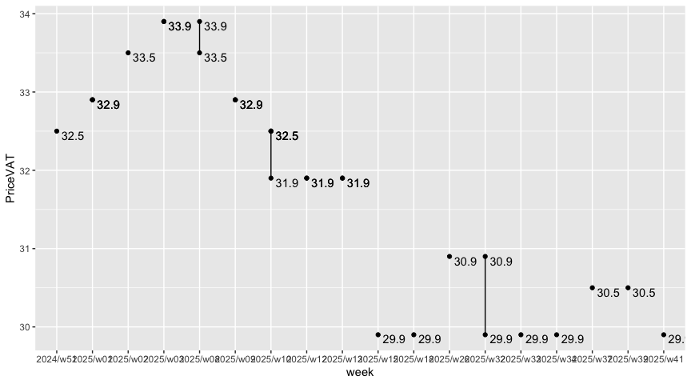

Spot On
================

|       Date |     Week |
|-----------:|---------:|
| 2024-02-27 | 2024/w09 |

### Tank Ono

> Gasoline BA95

| vendor  | origin   | week     | date       | day       | fuel      | price | PriceVAT |
|:--------|:---------|:---------|:-----------|:----------|:----------|------:|---------:|
| TankOno | webslurp | 2024/w09 | 2024-02-27 | Tuesday   | NATURAL95 | 30.17 |     36.5 |
| TankOno | webslurp | 2024/w06 | 2024-02-09 | Friday    | NATURAL95 | 29.34 |     35.5 |
| TankOno | webslurp | 2024/w06 | 2024-02-08 | Thursday  | NATURAL95 | 29.34 |     35.5 |
| TankOno | webslurp | 2024/w06 | 2024-02-07 | Wednesday | NATURAL95 | 29.34 |     35.5 |
| TankOno | webslurp | 2024/w06 | 2024-02-06 | Tuesday   | NATURAL95 | 29.34 |     35.5 |
| TankOno | webslurp | 2024/w05 | 2024-02-04 | Sunday    | NATURAL95 | 29.34 |     35.5 |
| TankOno | webslurp | 2024/w04 | 2024-01-24 | Wednesday | NATURAL95 | 28.84 |     34.9 |

> Diesel

| vendor  | origin   | week     | date       | day       | fuel   | price | PriceVAT |
|:--------|:---------|:---------|:-----------|:----------|:-------|------:|---------:|
| TankOno | webslurp | 2024/w09 | 2024-02-27 | Tuesday   | DIESEL | 30.50 |     36.9 |
| TankOno | webslurp | 2024/w06 | 2024-02-09 | Friday    | DIESEL | 29.34 |     35.5 |
| TankOno | webslurp | 2024/w06 | 2024-02-08 | Thursday  | DIESEL | 29.34 |     35.5 |
| TankOno | webslurp | 2024/w06 | 2024-02-07 | Wednesday | DIESEL | 29.34 |     35.5 |
| TankOno | webslurp | 2024/w06 | 2024-02-06 | Tuesday   | DIESEL | 29.34 |     35.5 |
| TankOno | webslurp | 2024/w05 | 2024-02-04 | Sunday    | DIESEL | 29.34 |     35.5 |
| TankOno | webslurp | 2024/w04 | 2024-01-24 | Wednesday | DIESEL | 28.51 |     34.5 |

### Axigon

> Diesel

| vendor | origin   | week     | date       | day       | fuel   | price | PriceVAT |
|:-------|:---------|:---------|:-----------|:----------|:-------|------:|---------:|
| AXIGON | webslurp | 2024/w09 | 2024-02-27 | Tuesday   | Diesel |  31.2 |     37.8 |
| AXIGON | webslurp | 2024/w06 | 2024-02-09 | Friday    | Diesel |  30.4 |     36.8 |
| AXIGON | webslurp | 2024/w06 | 2024-02-08 | Thursday  | Diesel |  30.4 |     36.8 |
| AXIGON | webslurp | 2024/w06 | 2024-02-07 | Wednesday | Diesel |  30.4 |     36.8 |
| AXIGON | webslurp | 2024/w06 | 2024-02-06 | Tuesday   | Diesel |  30.4 |     36.8 |
| AXIGON | webslurp | 2024/w05 | 2024-02-04 | Sunday    | Diesel |  30.3 |     36.7 |
| AXIGON | webslurp | 2024/w04 | 2024-01-24 | Wednesday | Diesel |  29.7 |     36.0 |

### UIC

> Diesel

| vendor | origin  | week     | date       | day       | fuel           | price | priceVAT |
|:-------|:--------|:---------|:-----------|:----------|:---------------|------:|---------:|
| UIC    | web/csv | 2024/w09 | 2024-02-27 | Tuesday   | Motorová nafta |  30.0 |     36.3 |
| UIC    | web/csv | 2024/w08 | 2024-02-24 | Saturday  | Motorová nafta |  29.9 |     36.2 |
| UIC    | web/csv | 2024/w08 | 2024-02-23 | Friday    | Motorová nafta |  30.0 |     36.3 |
| UIC    | web/csv | 2024/w08 | 2024-02-22 | Thursday  | Motorová nafta |  30.1 |     36.4 |
| UIC    | web/csv | 2024/w08 | 2024-02-21 | Wednesday | Motorová nafta |  30.3 |     36.7 |
| UIC    | web/csv | 2024/w08 | 2024-02-20 | Tuesday   | Motorová nafta |  30.7 |     37.1 |
| UIC    | web/csv | 2024/w07 | 2024-02-17 | Saturday  | Motorová nafta |  30.6 |     37.0 |
| UIC    | web/csv | 2024/w07 | 2024-02-16 | Friday    | Motorová nafta |  30.9 |     37.4 |
| UIC    | web/csv | 2024/w07 | 2024-02-15 | Thursday  | Motorová nafta |  30.8 |     37.3 |
| UIC    | web/csv | 2024/w07 | 2024-02-14 | Wednesday | Motorová nafta |  30.6 |     37.0 |
| UIC    | web/csv | 2024/w07 | 2024-02-13 | Tuesday   | Motorová nafta |  30.3 |     36.7 |
| UIC    | web/csv | 2024/w06 | 2024-02-10 | Saturday  | Motorová nafta |  30.2 |     36.5 |
| UIC    | web/csv | 2024/w06 | 2024-02-09 | Friday    | Motorová nafta |  29.7 |     35.9 |
| UIC    | web/csv | 2024/w06 | 2024-02-08 | Thursday  | Motorová nafta |  29.5 |     35.7 |

> Gasoline BA95

| vendor | origin  | week     | date       | day       | fuel        | price | priceVAT |
|:-------|:--------|:---------|:-----------|:----------|:------------|------:|---------:|
| UIC    | web/csv | 2024/w09 | 2024-02-27 | Tuesday   | Benzin BA95 |  30.1 |     36.4 |
| UIC    | web/csv | 2024/w08 | 2024-02-24 | Saturday  | Benzin BA95 |  30.1 |     36.4 |
| UIC    | web/csv | 2024/w08 | 2024-02-23 | Friday    | Benzin BA95 |  30.1 |     36.4 |
| UIC    | web/csv | 2024/w08 | 2024-02-22 | Thursday  | Benzin BA95 |  30.1 |     36.4 |
| UIC    | web/csv | 2024/w08 | 2024-02-21 | Wednesday | Benzin BA95 |  30.2 |     36.5 |
| UIC    | web/csv | 2024/w08 | 2024-02-20 | Tuesday   | Benzin BA95 |  30.3 |     36.7 |
| UIC    | web/csv | 2024/w07 | 2024-02-17 | Saturday  | Benzin BA95 |  30.3 |     36.7 |
| UIC    | web/csv | 2024/w07 | 2024-02-16 | Friday    | Benzin BA95 |  30.3 |     36.7 |
| UIC    | web/csv | 2024/w07 | 2024-02-15 | Thursday  | Benzin BA95 |  30.2 |     36.5 |
| UIC    | web/csv | 2024/w07 | 2024-02-14 | Wednesday | Benzin BA95 |  30.1 |     36.4 |
| UIC    | web/csv | 2024/w07 | 2024-02-13 | Tuesday   | Benzin BA95 |  29.8 |     36.1 |
| UIC    | web/csv | 2024/w06 | 2024-02-10 | Saturday  | Benzin BA95 |  29.7 |     35.9 |
| UIC    | web/csv | 2024/w06 | 2024-02-09 | Friday    | Benzin BA95 |  29.5 |     35.7 |
| UIC    | web/csv | 2024/w06 | 2024-02-08 | Thursday  | Benzin BA95 |  29.3 |     35.5 |

