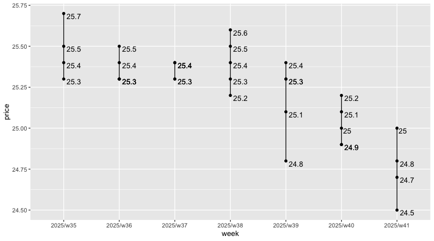

Spot On
================

|       Date |     Week |
|-----------:|---------:|
| 2023-04-22 | 2023/w16 |

### Tank Ono

> Gasoline BA95

| vendor  | origin   | week     | date       | day       | fuel      | price | PriceVAT |
|:--------|:---------|:---------|:-----------|:----------|:----------|------:|---------:|
| TankOno | webslurp | 2023/w16 | 2023-04-22 | Saturday  | NATURAL95 | 29.67 |     35.9 |
| TankOno | webslurp | 2023/w16 | 2023-04-20 | Thursday  | NATURAL95 | 30.50 |     36.9 |
| TankOno | webslurp | 2023/w16 | 2023-04-19 | Wednesday | NATURAL95 | 30.50 |     36.9 |
| TankOno | webslurp | 2023/w14 | 2023-04-08 | Saturday  | NATURAL95 | 30.17 |     36.5 |
| TankOno | webslurp | 2023/w14 | 2023-04-06 | Thursday  | NATURAL95 | 29.67 |     35.9 |
| TankOno | webslurp | 2023/w14 | 2023-04-05 | Wednesday | NATURAL95 | 29.67 |     35.9 |
| TankOno | webslurp | 2023/w14 | 2023-04-04 | Tuesday   | NATURAL95 | 29.67 |     35.9 |

> Diesel

| vendor  | origin   | week     | date       | day       | fuel   | price | PriceVAT |
|:--------|:---------|:---------|:-----------|:----------|:-------|------:|---------:|
| TankOno | webslurp | 2023/w16 | 2023-04-22 | Saturday  | DIESEL | 25.54 |     30.9 |
| TankOno | webslurp | 2023/w16 | 2023-04-20 | Thursday  | DIESEL | 26.36 |     31.9 |
| TankOno | webslurp | 2023/w16 | 2023-04-19 | Wednesday | DIESEL | 26.36 |     31.9 |
| TankOno | webslurp | 2023/w14 | 2023-04-08 | Saturday  | DIESEL | 26.36 |     31.9 |
| TankOno | webslurp | 2023/w14 | 2023-04-06 | Thursday  | DIESEL | 26.86 |     32.5 |
| TankOno | webslurp | 2023/w14 | 2023-04-05 | Wednesday | DIESEL | 26.86 |     32.5 |
| TankOno | webslurp | 2023/w14 | 2023-04-04 | Tuesday   | DIESEL | 26.86 |     32.5 |

### Axigon

> Diesel

| vendor | origin   | week     | date       | day       | fuel   | price | PriceVAT |
|:-------|:---------|:---------|:-----------|:----------|:-------|------:|---------:|
| AXIGON | webslurp | 2023/w16 | 2023-04-22 | Saturday  | Diesel |  26.9 |     32.6 |
| AXIGON | webslurp | 2023/w16 | 2023-04-20 | Thursday  | Diesel |  26.9 |     32.6 |
| AXIGON | webslurp | 2023/w16 | 2023-04-19 | Wednesday | Diesel |  26.9 |     32.6 |
| AXIGON | webslurp | 2023/w14 | 2023-04-08 | Saturday  | Diesel |  27.3 |     33.0 |
| AXIGON | webslurp | 2023/w14 | 2023-04-06 | Thursday  | Diesel |  27.3 |     33.0 |
| AXIGON | webslurp | 2023/w14 | 2023-04-05 | Wednesday | Diesel |  27.3 |     33.0 |
| AXIGON | webslurp | 2023/w14 | 2023-04-04 | Tuesday   | Diesel |  27.3 |     33.0 |

### UIC

> Diesel

| vendor | origin  | week     | date       | day       | fuel           | price | priceVAT |
|:-------|:--------|:---------|:-----------|:----------|:---------------|------:|---------:|
| UIC    | web/csv | 2023/w16 | 2023-04-22 | Saturday  | Motorová nafta |  24.8 |     30.0 |
| UIC    | web/csv | 2023/w16 | 2023-04-21 | Friday    | Motorová nafta |  25.0 |     30.2 |
| UIC    | web/csv | 2023/w16 | 2023-04-20 | Thursday  | Motorová nafta |  25.3 |     30.6 |
| UIC    | web/csv | 2023/w16 | 2023-04-19 | Wednesday | Motorová nafta |  25.3 |     30.6 |
| UIC    | web/csv | 2023/w16 | 2023-04-18 | Tuesday   | Motorová nafta |  25.3 |     30.6 |
| UIC    | web/csv | 2023/w15 | 2023-04-15 | Saturday  | Motorová nafta |  25.5 |     30.9 |
| UIC    | web/csv | 2023/w15 | 2023-04-14 | Friday    | Motorová nafta |  25.7 |     31.1 |
| UIC    | web/csv | 2023/w15 | 2023-04-13 | Thursday  | Motorová nafta |  25.7 |     31.1 |
| UIC    | web/csv | 2023/w15 | 2023-04-12 | Wednesday | Motorová nafta |  25.9 |     31.3 |
| UIC    | web/csv | 2023/w14 | 2023-04-07 | Friday    | Motorová nafta |  25.9 |     31.3 |
| UIC    | web/csv | 2023/w14 | 2023-04-06 | Thursday  | Motorová nafta |  25.9 |     31.3 |
| UIC    | web/csv | 2023/w14 | 2023-04-05 | Wednesday | Motorová nafta |  25.9 |     31.3 |
| UIC    | web/csv | 2023/w14 | 2023-04-04 | Tuesday   | Motorová nafta |  25.9 |     31.3 |
| UIC    | web/csv | 2023/w13 | 2023-04-01 | Saturday  | Motorová nafta |  25.7 |     31.1 |

> Gasoline BA95

| vendor | origin  | week     | date       | day       | fuel        | price | priceVAT |
|:-------|:--------|:---------|:-----------|:----------|:------------|------:|---------:|
| UIC    | web/csv | 2023/w16 | 2023-04-22 | Saturday  | Benzin BA95 |  29.4 |     35.6 |
| UIC    | web/csv | 2023/w16 | 2023-04-21 | Friday    | Benzin BA95 |  29.6 |     35.8 |
| UIC    | web/csv | 2023/w16 | 2023-04-20 | Thursday  | Benzin BA95 |  29.7 |     35.9 |
| UIC    | web/csv | 2023/w16 | 2023-04-19 | Wednesday | Benzin BA95 |  29.9 |     36.2 |
| UIC    | web/csv | 2023/w16 | 2023-04-18 | Tuesday   | Benzin BA95 |  30.0 |     36.3 |
| UIC    | web/csv | 2023/w15 | 2023-04-15 | Saturday  | Benzin BA95 |  30.3 |     36.7 |
| UIC    | web/csv | 2023/w15 | 2023-04-14 | Friday    | Benzin BA95 |  30.4 |     36.8 |
| UIC    | web/csv | 2023/w15 | 2023-04-13 | Thursday  | Benzin BA95 |  30.7 |     37.1 |
| UIC    | web/csv | 2023/w15 | 2023-04-12 | Wednesday | Benzin BA95 |  30.5 |     36.9 |
| UIC    | web/csv | 2023/w14 | 2023-04-07 | Friday    | Benzin BA95 |  30.5 |     36.9 |
| UIC    | web/csv | 2023/w14 | 2023-04-06 | Thursday  | Benzin BA95 |  30.4 |     36.8 |
| UIC    | web/csv | 2023/w14 | 2023-04-05 | Wednesday | Benzin BA95 |  30.5 |     36.9 |
| UIC    | web/csv | 2023/w14 | 2023-04-04 | Tuesday   | Benzin BA95 |  30.5 |     36.9 |
| UIC    | web/csv | 2023/w13 | 2023-04-01 | Saturday  | Benzin BA95 |  30.1 |     36.4 |

